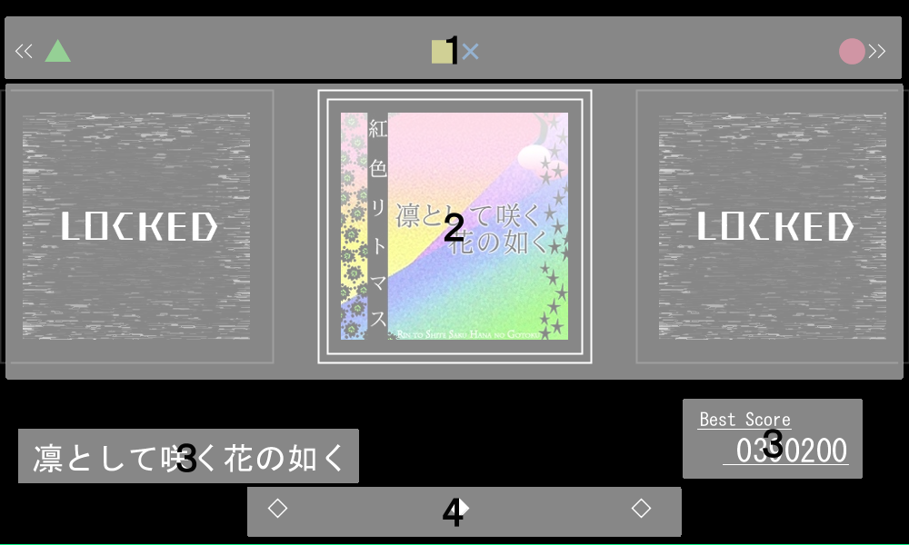
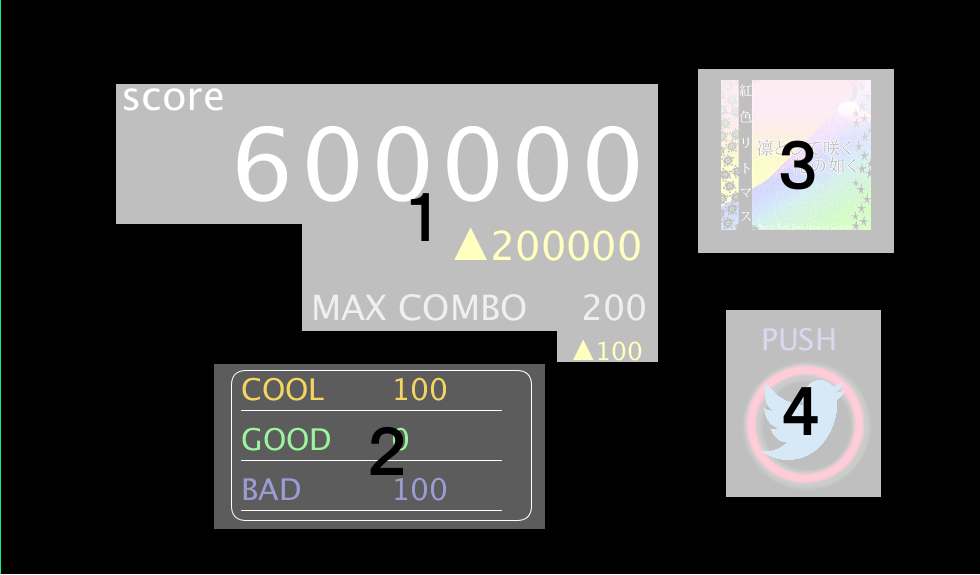
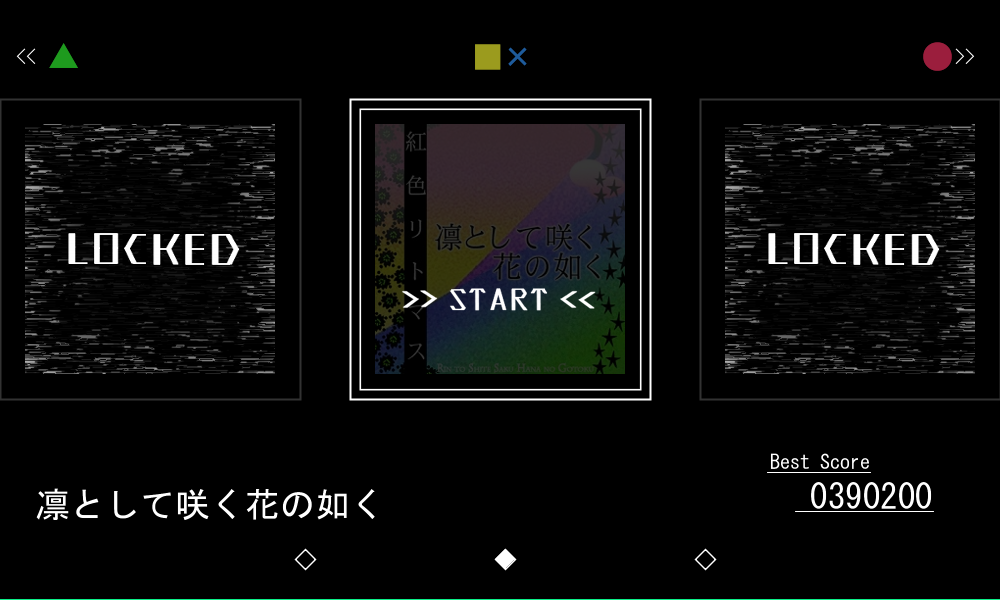
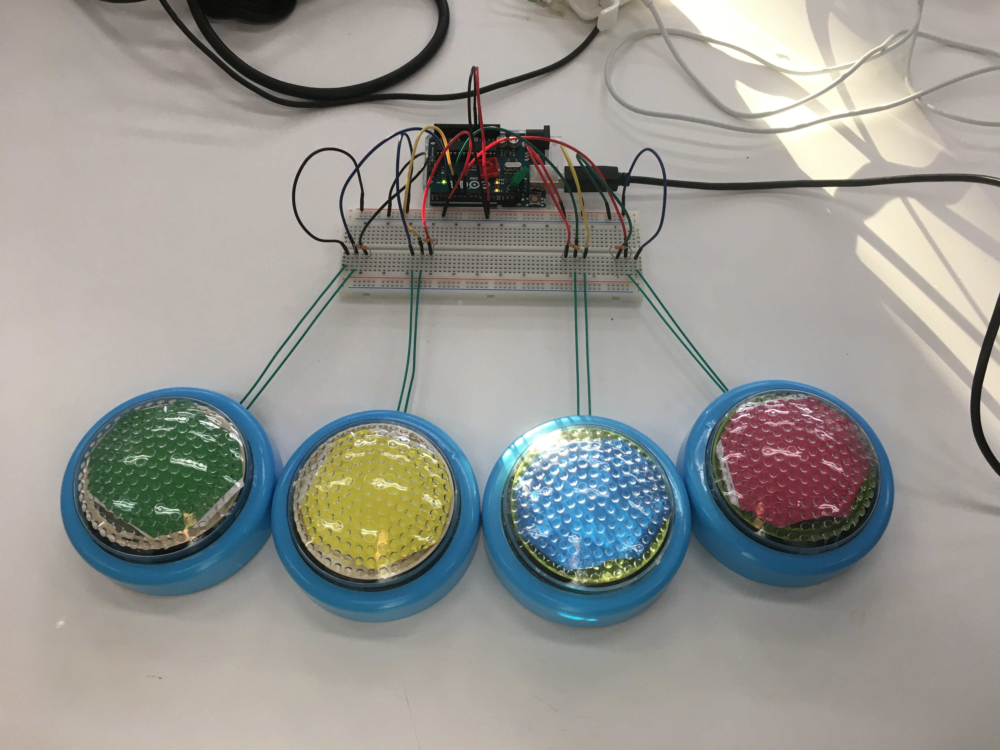
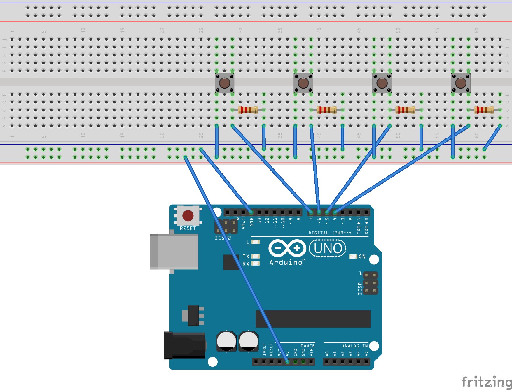
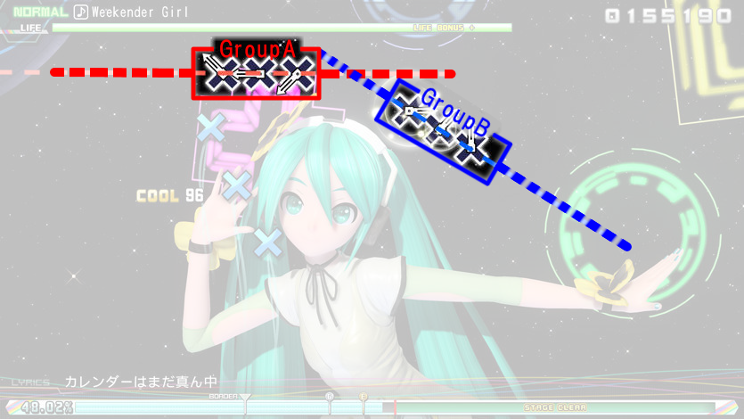
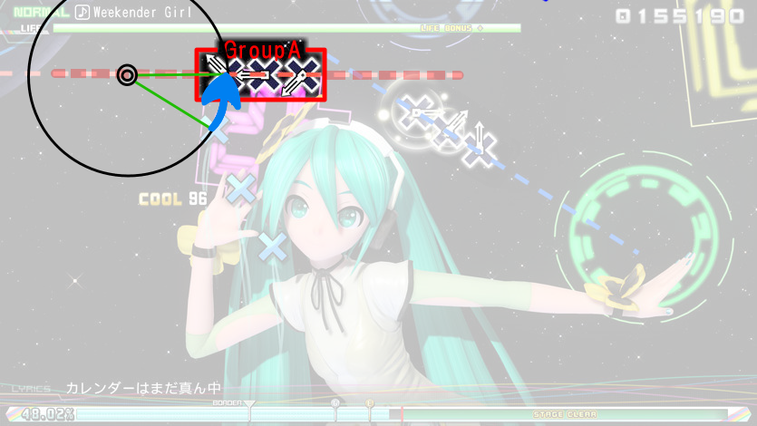
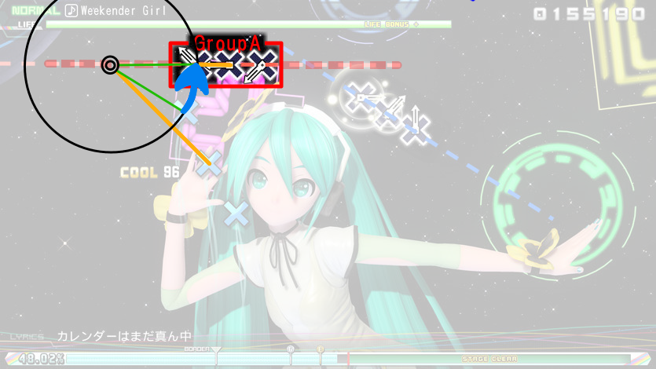

# README.md

## 目次

- 注意
- 画面構成
- 操作説明
- 譜面ファイル(JSON)の書き方
- 新規楽曲データの追加方法
- ディレクトリ構造
- 作業分担
- 謝辞
- 利用したソフトウェア
- 参考サイト

## 注意
現時点では、mac book pro, Processing 3.2.3以外での動作確認が取れていません。

起動する際はmac OSのProcessing 3.2.3で起動して下さい。

それでも起動ができない際は、18班のメンバーに連絡をいただけると幸いです。

## 画面構成

### 曲選択画面

曲選択画面の構成は以下のようになっている。



1. LEFT keyとArduinoの緑ボタン、RIGHT keyとArduinoの赤ボタン、ENTER keyとArduinoの黄色、青ボタンが対応していることを示している。

2. 選択中の曲、およびその左右ののジャケット画像が表示される。１で示されたkeyで操作する。

3. 曲名、ベストスコアが表示される。

4. 画面に映し出されている3枚のジャケットがどの位置に存在するのかを示している。


### プレイ画面

プレイ画面の構成は以下のようになっている。


1. 選択された楽曲名が表示される。

2. 動画、ノーツ、および判定が描写される。

3. 歌詞が表示される。


### リザルト画面

リザルト画面の構成は以下のようになっている。



1. スコア、およびコンボ数が表示される。

2. COOL,GOOD,BADに判定されたノーツ数がそれぞれ表示される。

3. プレイした楽曲のジャケット画像が表示される。

4. Arduinoの赤ボタン、またはENTER keyを押すことでスコアとコンボ数をTwitterで共有することができる。


## 操作説明

### arduinoからの操作

1. arduinoの▲、●ボタンを押し、プレイしたい曲を中心に表示させる。

2. arduinoの■、×ボタンを押し確定する。


### キーボードからの操作

|   対応するキー             |  V |  B |  N |  M |
|:--------------------------:|:--:|:--:|:--:|:--:|
|   メニュー画面でのキー操作 | ← | Enter | Enter | → |
|   楽曲プレイ中のキー操作   | ▲ | ■ | ✖ | ● |
|   リザルト画面でのキー操作 |メニューに戻る|メニューに戻る|メニューに戻る|リザルトをツイートする|

- メニュー画面では左右の方向キー、Enterキーからの入力も可

### ボタン(arduino)について

- ボタンはタクトスイッチ４つを用いて、arduinoで作成した。
- ボタン本体は１００円ショップで買ったタッチライトを改造して作った。



###配置について

|         対応する色         | <font color=green>GREEN</font> | <font color=yellow><mark>YELLOW</mark></font> | <font color=blue>BLUE</font> | <font color=red>RED</font> |
|:--------------------------:|:--:|:--:|:--:|:--:|
|   楽曲プレイ中のキー操作   |  V |  B |  N |  M |
|      arduinoからの操作     | ▲ | ■ | ✖ | ● |

###配線について

| ボタン  |       ピン       |
|:-------:|:----------------:|
|    ●   | digitalの４番pin |
|    ✖   | digitalの５番pin |
|    ■   | digitalの６番pin |
|    ▲   | digitalの７番pin |



### プログラム内での接続について

- processingのプログラムを起動する前に、 `button_arduino/button_arduino.ino` を起動して、arduino本体に書き込みを行う。
- `project_MIKO.pde` 内の52行目の `Serial.list()` の引数がPCによって異なるため、自分で設定する。
	- ```serial = new Serial( this, Serial.list()[2], 9600 );```
- arduinoとの接続が50%ほどの確率で失敗するため、接続が失敗したら再度接続を試みるという操作を10回繰り返している。

## 譜面ファイル(JSON)の書き方

### ノーツの動き方



画像のようにノーツは直線に並ぶことが多く、直線毎にグループ分けすることが可能である。



全てのノーツはそれぞれ何らかの円周上を動いていると考られる。



同じグループに分類されたノーツは同一の点を中心に円を描くように動いている。

### 譜面ファイルの内部構造

譜面ファイルの中身は`Group`オブジェクトが入った`Groups`という配列で表現している。数値は `Route` の `theta` を除いて全て整数である。( `theta` のみ小数)

#### Group

`Group` は `Route` と `Note` の集まりである。 `Group` は上記の画像の各点線を１つの集合とみなしたものである。

#### Route

ノーツの描く軌道や、点線の角度などの情報を保持するJSONオブジェクトである。

```json
"Route": {
	"center": {
        "x": -100, 
        "y": -100
    }, 
    "pos": {
        "x": 50, 
        "y": 250
    }, 
        "direction": 1, 
        "speed": 70, 
        "theta": 0.5,
        "time": 30,
        "figure": 0
}
```

- `center`
	- ノーツが動く軌道の円の中心座標オブジェクト
	- `x` と `y` の療法を指定する(直交座標系)
- `pos`
	- 最初のノーツの位置座標オブジェクト
	- `x` と `y` の療法を指定する(直交座標系)
- `speed`
	- ノーツの動く速さ(グループ内で一定)
- `theta`
	- ノーツが並ぶ直線の傾き(極座標系で0〜6.28)
- `direction`
	- ノーツの回転方向
	-  1 : 時計回り
	- -1 : 反時計回り
- `timing`
	- 最初のノーツが押される理想のタイミング
	- 曲が始まってからの時間を指定(1あたり0.05秒)
- `figure`
	- 最初のノーツの形(0:◯, 1:X, 2:△, 3:◻)
- `duration`
	- 最初のノーツの長押しのノーツのときのみ記載
	- 押してる時間を指定

#### Notes

グループの先頭のノーツを除くノーツは `Notes` というJSON配列の中に格納する。１つ前のノーツとの差を指定する。

```json
"Notes": [
	{
		"distance": 60, 
		"figure": 0, 
		"time": 5
	}, 
	{
		"distance": 60, 
		"figure": 0,
		"time": 5,
		"duration": 10
	},
	
	:
	
]
```

- `distance`
	- １つ前のノーツとの距離を指定する(極座標系)
	- 座標の変位は `(distance, theta)`
	- 中心方向が負
- `time`
	- 時間の変位を指定する
- `figure`
	- ノーツの形(0:◯, 1:X, 2:△, 3:◻)
- `duration`
	- ノーツの長押しのノーツのときのみ記載
	- 押してる時間を指定

### JSONサンプル

```json

{
    "Groups": [
        {
            "Route": {
                "center": {
                    "x": -100, 
                    "y": -100
                }, 
                "pos": {
                    "x": 50, 
                    "y": 250
                }, 
                "direction": 1, 
                "speed": 70, 
                "theta": 0.5,
                "time": 30,
                "figure": 0
            }, 
            "Notes": [
                {
                    "distance": 60, 
                    "figure": 0, 
                    "time": 5
                }, 
                {
                    "distance": 60, 
                    "figure": 0, 
                    "time": 5,
                    "duration": 10
                },
                
                :
                
            ]
        },
        
        :
        
    ]
}
```

## 新規楽曲データの追加方法

### 新しい楽曲データ `meiji` を追加する場合

```
project_MIKO/
|--data/  
|  |--meiji/
|  |  |--jacket.png
|  |  |--lyrics.txt
|  |  |--movie.mov
|  |  |--notes.json
|  |  |--score.txt
|  |
|  |--songs_list.txt
|  |
|  |--music_title.txt               
|  |
:  :
```

### 新規楽曲ディレクトリ以下に追加するファイル

- `jacket.png`
	- 曲選択画面や、リザルト時に表示される楽曲のジャケット画像
- `lyrics.txt`
	- 楽曲プレイ中に表示される歌詞に関するテキストファイル
	1. 奇数行に歌詞データを１フレーズ毎に書く
	2. 偶数行に一つ上のフレーズが何秒から表示するかを指定する(小数での指定が可能)
- `movie.mov`
 	- 音データの埋め込まれた動画ファイル
	- 楽曲プレイ中に背景として表示される
	- 楽曲の再生時間は動画の長さに合わせている
- `notes.json`
	- ノーツの位置や動きを定義したJSONファイル
	- 書き方については `譜面ファイル(JSON)の書き方.pdf` を参照
- `score.txt`
	- 前回までの最高スコアと最大コンボ数を保持するテキストファイル
	- １行目は過去の最大スコア
	- ２行目は過去の最大コンボ数

### その他の変更

- `music_title.txt`
	- ディレクトリ名と楽曲名を表記する
	- ex) `meiji` ディレクトリの `明治大学校歌` という楽曲名の場合
		- `meiji,明治大学校歌`
- `songs_list.txt`
	- 読み込む楽曲のディレクトリ名を羅列する
	- ロックされている楽曲を表示したい場合は `noimage` と表記


## ディレクトリ構造

```
project_MIKO/
|
|--README/
|  |--img/
|  |  |--button_circuit.png
|  |  |--button_image.jpg
|  |  |--diva.jpg
|  |  |--start01.gif
|  |  |--start02.png
|  |  |--start03.png
|  |
|  |--譜面ファイル(JSON)の書き方.md
|  |--曲選択画面の操作方法.md
|  |--新規楽曲データの追加方法.md
|  |--arduinoの組み方.md
|  |--目次.md
|
|--data/                              // ゲーム内で使用する素材や楽曲データ等
|  |--material/                       // 画像素材
|  |  |--appear.png
|  |  |--bable.png
|  |  |--back.png
|  |  |--circle.png
|  |  |--rinhana.png
|  |  |--start.png
|  |  |--tweet.png
|  |  |--female0.png
|  |  |--female1.png
|  |  |--female2.png
|  |  |--female3.png
|  |  |--female_long0.png
|  |  |--female_long1.png
|  |  |--female_long2.png
|  |  |--female_long3.png
|  |  |--male0.png
|  |  |--male1.png
|  |  |--male2.png
|  |  |--male3.png
|  |  |--male_long0.png
|  |  |--male_long1.png
|  |  |--male_long2.png
|  |  |--male_long3.png
|  |
|  |--sound/                          // 音素材
|  |  |--menu_enter.wav
|  |  |--menu_select.wav
|  |  |--play_tap.wav
|  |  |--result_clear.wav
|  |
|  |--rinhana/                        // "凛として咲く花の如く"の楽曲データ
|  |  |--jacket.png
|  |  |--lyrics.txt
|  |  |--movie.mov
|  |  |--notes.json
|  |  |--score.txt
|  |
|  |--noimage/                        // LOCKEDされた楽曲に関するデータファイル
|  |  |--jacket.png
|  |  |--score.txt
|  |
|  |--songs_list.txt                  // 読み込む楽曲のディレクトリ名を指定する
|  |--music_title.txt                 // ディレクトリ名と楽曲名の組み合わせを表記する
|
|--button_arduino/                    // arduinoのコード
|  |--button_arduino.ino
|
|--project_MIKO.pde                   // 以下、processingのコード
|--Button.pde
|--Det.pde
|--Effect.pde
|--Group.pde
|--Lyrics.pde
|--Menu.pde
|--Music.pde
|--Note.pde
|--Result.pde
|--Route.pde
|--valiable.pde
```

## 作業分担

本プログラムにおけるそれぞれの記述した箇所はプログラム内に記述した。

* Shunsuke Mano
    + 監督
    + 譜面データ読み込み
* Tomoki Ikeda
    + 譜面作成
    + Arduino連携
* Machiko Ogawa
    + 楽曲アレンジ
    + 効果音作成
    + 動画編集
*  Yuki Kaneko
    + UIデザイン
    + 画像・動画素材作成

## 謝辞

宮下研究室の先輩方に発表用の動画作成、Processingでのメモリ上限開放のアドバイスなどを頂きました。本当にありがとうございました。

## 利用したソフトウェア
* Aviutl
* AzDrawing
* Azpainter
* Azpainter2
* CyberLink PowerDirector 13
* Fritzing
* vvvv

## 参考サイト
* [Comparator(Java Platform SE 6)](https://docs.oracle.com/javase/jp/6/api/java/util/Comparator.html)
* [動画素材.com](http://xn--hhro09bn9j8uh.com/)
* [ニコニ・コモンズ](http://commons.nicovideo.jp/)
* [project DIVA プレイ動画 - YouTube](https://www.youtube.com/results?search_query=project+DIVA+%E3%83%97%E3%83%AC%E3%82%A4%E5%8B%95%E7%94%BB)

----

本プログラムは2017年プログラミング演習2発表会のために制作された。

Copyright &copy; 2017 ProjectMIKO (小松研究室 B1 18班 発表順11)
