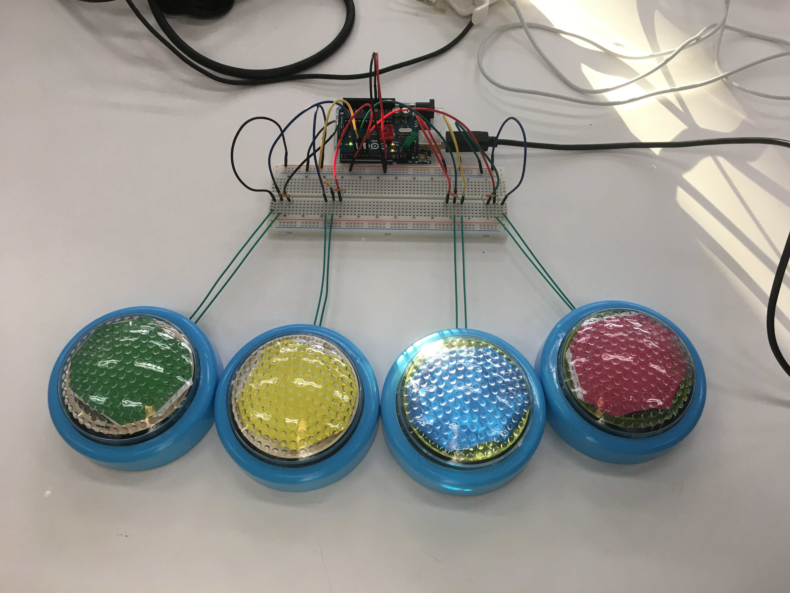
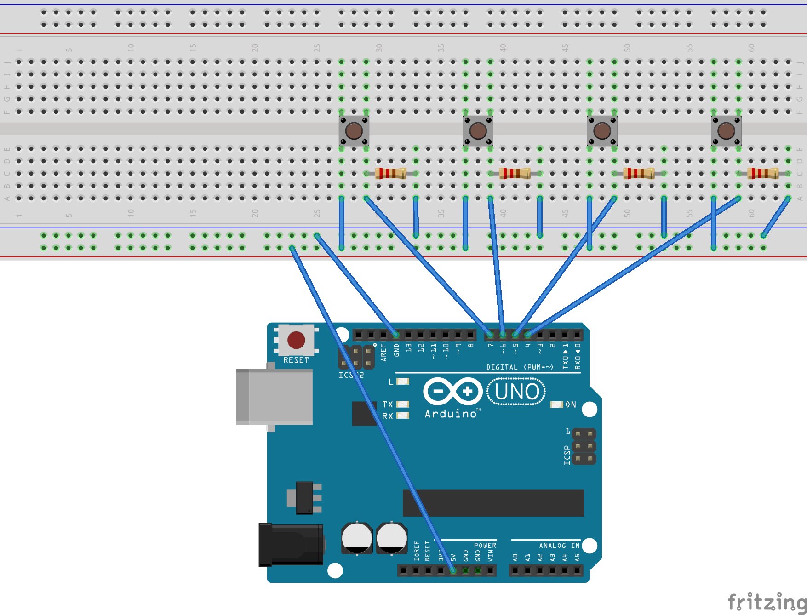

# ボタン(arduino)について

- ボタンはタクトスイッチ４つを使ってarduinoで作成しました。
- ボタン本体は１００円ショップで買ったタッチライトを改造して作りました。



###配置について

|      arduinoからの操作     | ▲ | ■ | ✖ | ● |
|:--------------------------:|:--:|:--:|:--:|:--:|
| **楽曲プレイ中のキー操作** |  V |  B |  N |  M |

###配線について

| ボタン  |       ピン       |
|:-------:|:----------------:|
|    ●   | digitalの４番pin |
|    ✖   | digitalの５番pin |
|    ■   | digitalの６番pin |
|    ▲   | digitalの７番pin |



### プログラム内での接続について

- processingのプログラムを起動する前に、 `button_arduino/button_arduino.ino` を起動して、arduino本体に書き込みを行ってください。
- `project_MIKO.pde` 内の52行目の `Serial.list()` の引数がPCによって異なるため、自分で設定してください。
	- ```serial = new Serial( this, Serial.list()[2], 9600 );```
- arduinoとの接続が50%ほどの確率で失敗するため、接続が失敗したら再度接続を試みるという操作を10回繰り返しています。
