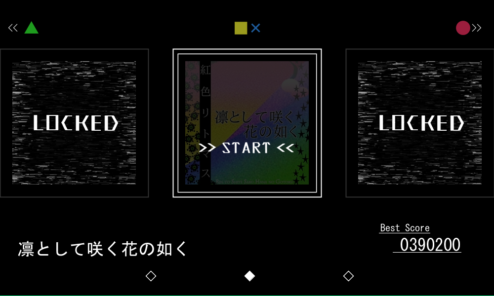

# 曲選択画面
----
## 操作説明
1. Arduinoの▲、●ボタン、もしくはLEFT/RIGHT keyを押し、プレイしたい曲を中心に表示させる。

2. Arduinoの■、×ボタン、もしくはENTER keyを押し.確定する。

----
## 画面構成
曲選択画面の構成は以下のようになっている。

1. LEFT keyとArduinoの緑ボタン、RIGHT keyとArduinoの赤ボタン、ENTER keyとArduinoの黄色、青ボタンが対応していることを示している。
2. 選択中の曲、およびその左右ののジャケット画像が表示される。１で示されたkeyで操作する。
3. 曲名、ベストスコアが表示される。
4. 画面に映し出されている3枚のジャケットがどの位置に存在するのかを示している。
----
