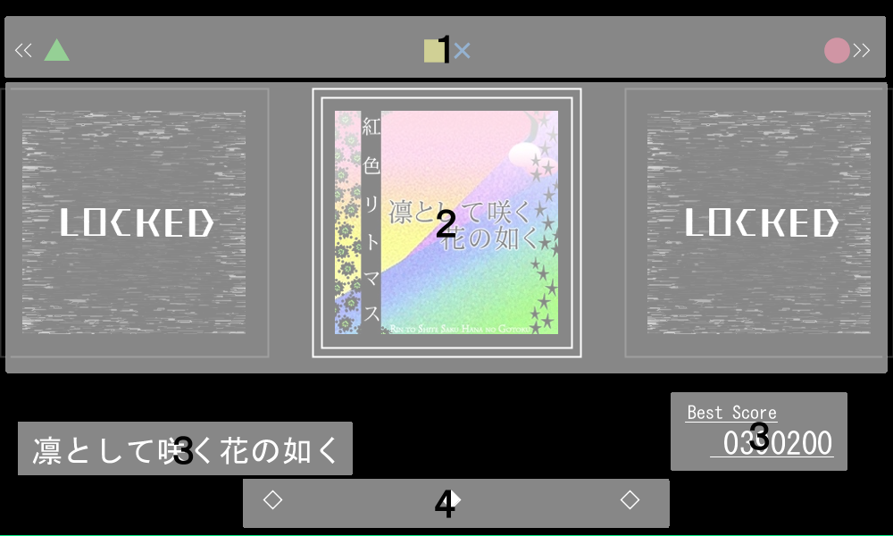
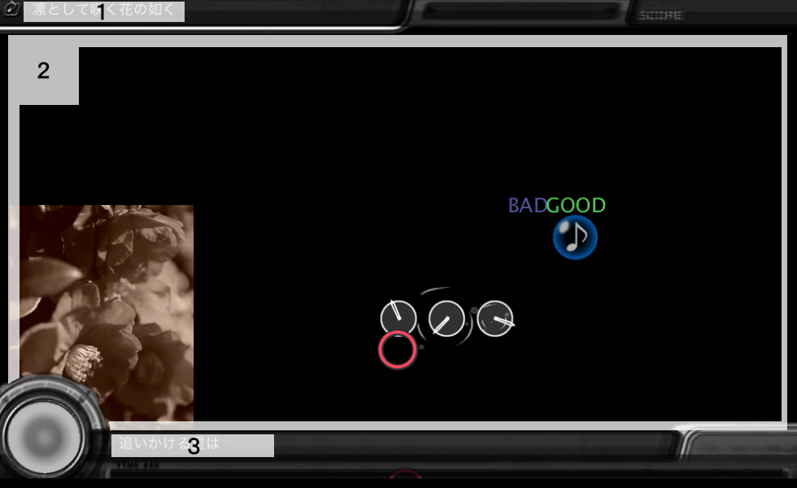
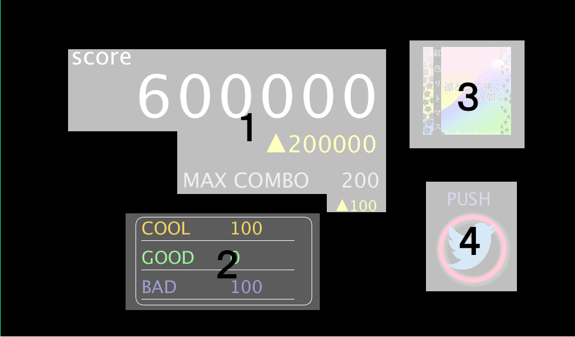

#README.md
----

## 注意
現時点では、mac book pro, Processing 3.2.3以外での動作確認が取れていません。

起動する際はmac OSのProcessing 3.2.3で起動して下さい。

それでも起動ができない際は、18班のメンバーに連絡をいただけると幸いです。

----
#画面構成

##曲選択画面

曲選択画面の構成は以下のようになっている。

1. LEFT keyとArduinoの緑ボタン、RIGHT keyとArduinoの赤ボタン、ENTER keyとArduinoの黄色、青ボタンが対応していることを示している。

2. 選択中の曲、およびその左右ののジャケット画像が表示される。１で示されたkeyで操作する。

3. 曲名、ベストスコアが表示される。

4. 画面に映し出されている3枚のジャケットがどの位置に存在するのかを示している。

##プレイ画面

プレイ画面の構成は以下のようになっている。

1. 選択された楽曲名が表示される。

2. 動画、ノーツ、および判定が描写される。

3. 歌詞が表示される。

##リザルト画面

リザルト画面の構成は以下のようになっている。

1. スコア、およびコンボ数が表示される。

2. COOL,GOOD,BADに判定されたノーツ数がそれぞれ表示される。

3. プレイした楽曲のジャケット画像が表示される。

4. Arduinoの赤ボタン、またはENTER keyを押すことでスコアとコンボ数をTwitterで共有することができる。

----
